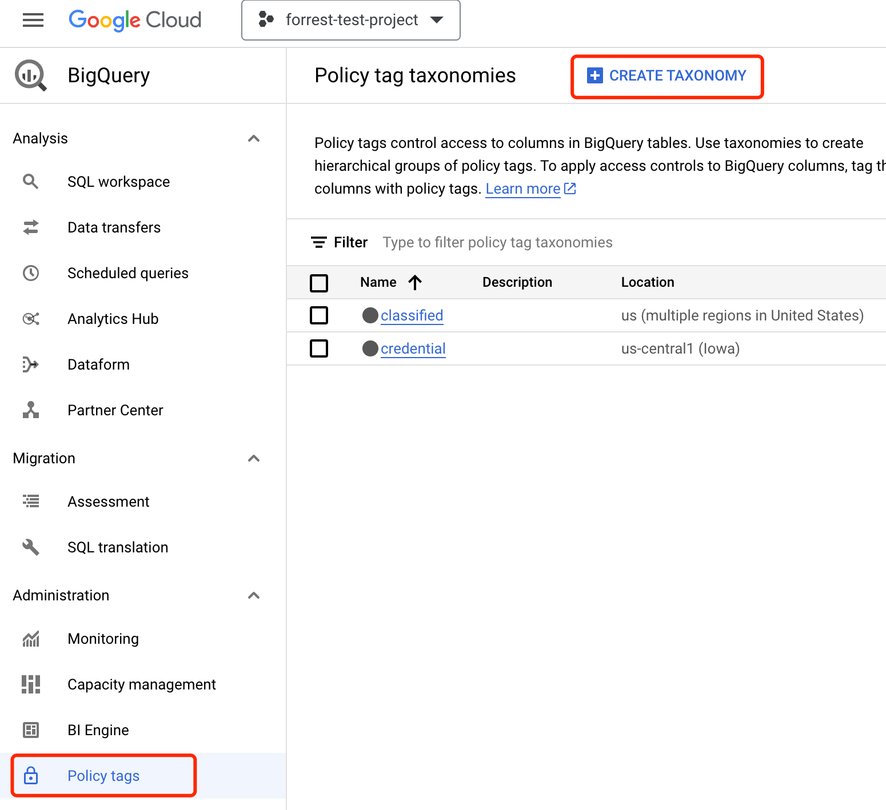
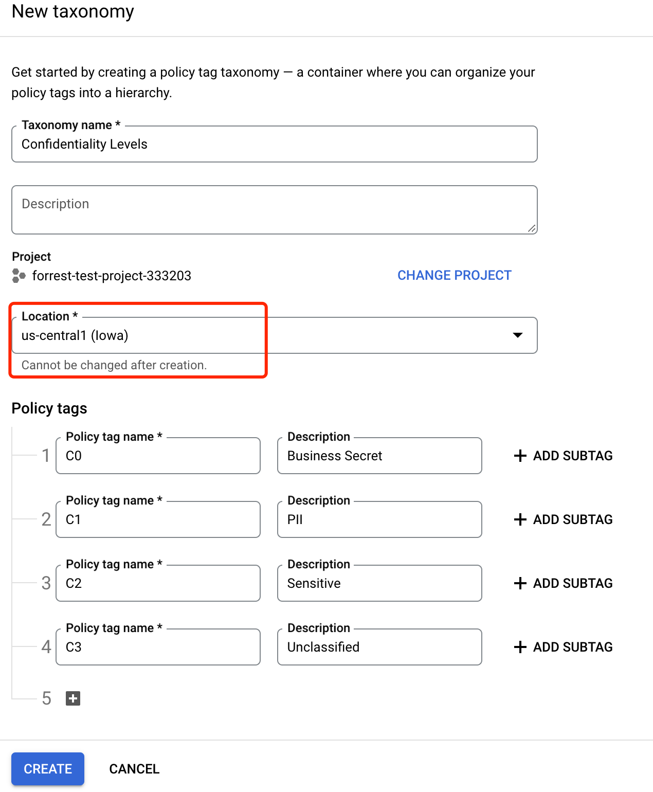
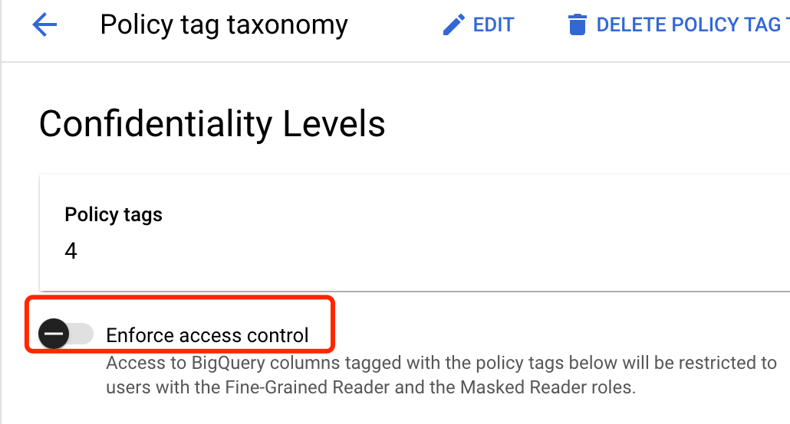
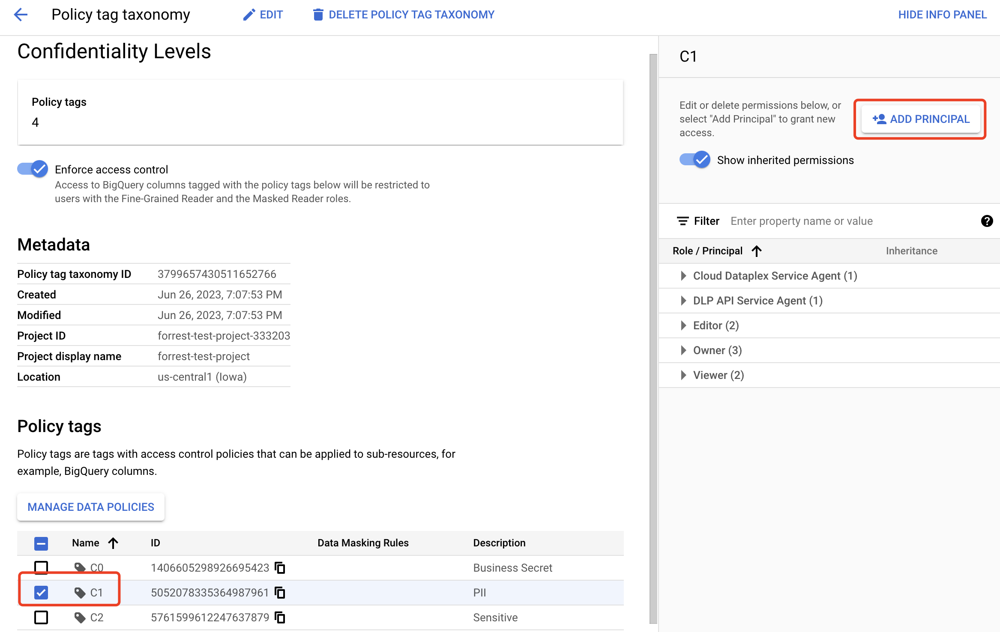
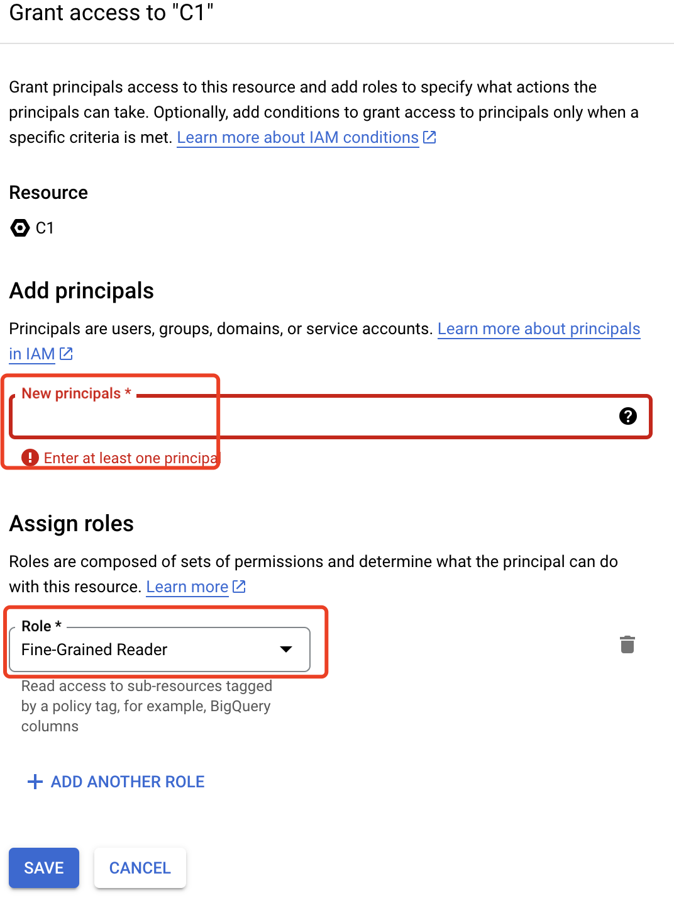
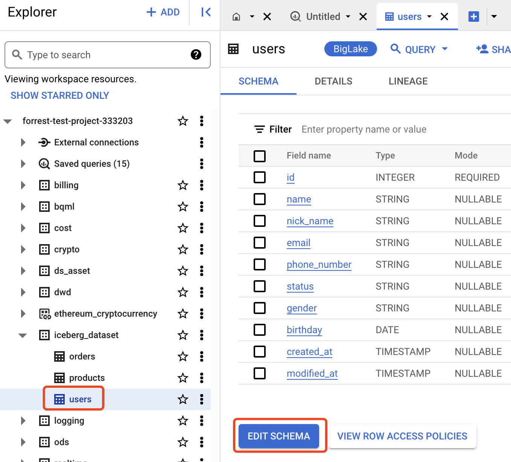
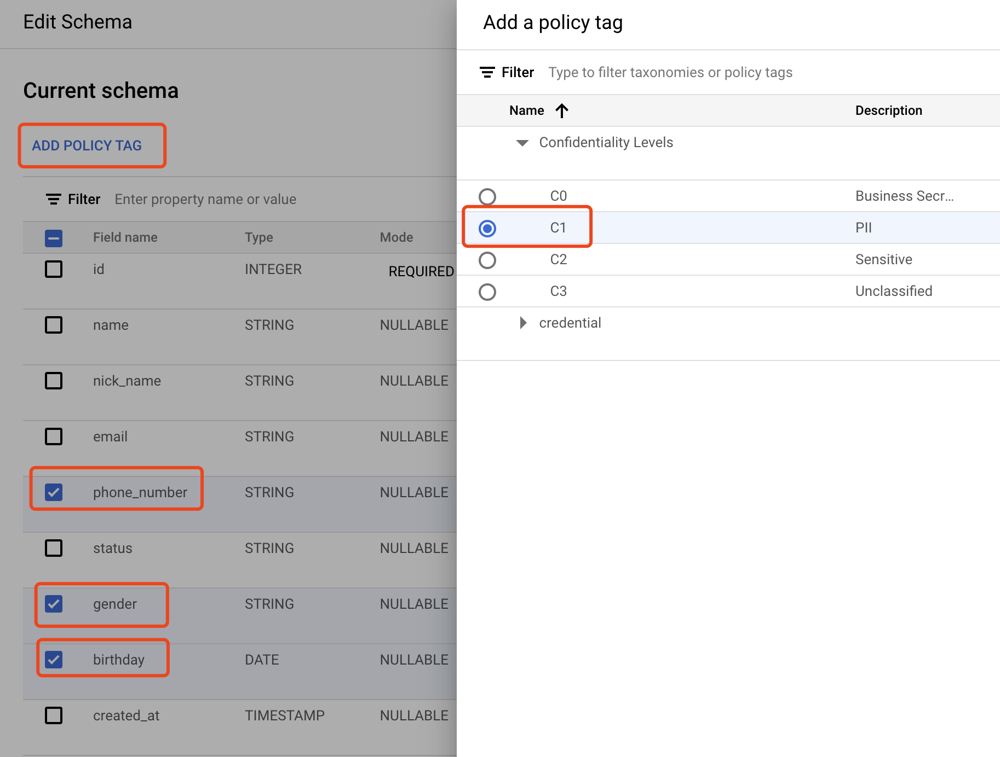
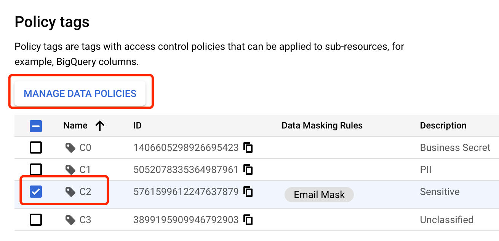
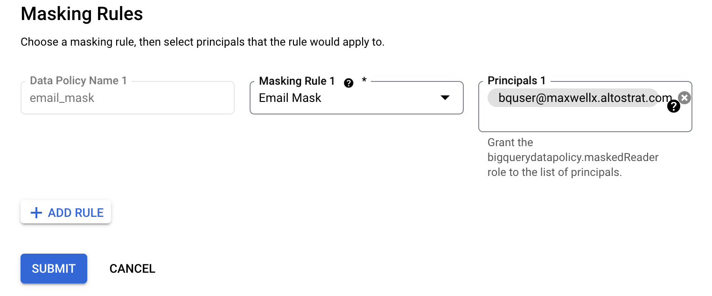
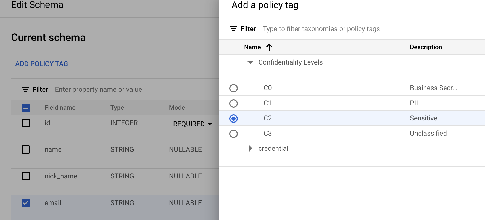

# BigLake lab: Integrate Biglake with Iceberg

This is a step by step guide of how to stream data to Google Cloud Storage (GCS) with Flink using iceberg format.

Components used in this lab:

- **Apache Iceberg** is an open table format for huge analytic datasets. Iceberg adds tables to compute engines including Google BigLake, Spark, Trino, PrestoDB, Flink, Hive and Impala using a high-performance table format that works just like a SQL table.
- **Apache Flink** is a popular framework and distributed processing engine for stateful computations over unbounded and bounded data streams.
- **Cloud Storage** is a managed service for storing structured and unstructured data. Store any amount of data and retrieve it as often as you like.
- **BigQuery** is a serverless, highly scalable and performant data analysis platform
- **BigLake** is a storage engine that unifies data warehouses and lakes, by providing uniform fine-grained access control, performance acceleration  across multi-cloud storage and open formats
- **Dataproc** is a fully managed Hadoop cluster bundled with popular components like HDFS, Flink, Spark, Hive.

## Prerequisitions

1. Create a GCP project
2. Setup vpc, network, firwall rule in your GCP project in **us-central1**
3. You need permission of BigQuery admin, Dataproc admin and Storage Admin
4. Create GCS buckets for dataproc staging and iceberg table

## Environment variables

Change these varaibles in your environment

```bash
export PROJECT=forrest-test-project-333203
export SUBNET=dataflow-network
export CLUSTER_NAME=iceberg-demo-cluster
export DATAPROC_BUCKET=forrest-dataproc-bucket
export WAREHOUSE_DIR=gs://my-dw-bucket/iceberg
export SA_NAME=iceberg-demo
export CONNECTION=biglake-iceberg
```

## Steps

Open `cloud shell` in your GCP console and follow the steps to run bash shell scripts.

### 1. Setup service account for dataproc

Create service account:

```bash
gcloud iam service-accounts create "${SA_NAME}" \
--project ${PROJECT} \
--description "Service account for Dataproc to run flink."
```

Bind roles to service account:

```bash
gcloud projects add-iam-policy-binding "${PROJECT}" \
--role roles/dataproc.worker \
--member "serviceAccount:${SA_NAME}@${PROJECT}.iam.gserviceaccount.com"

gcloud projects add-iam-policy-binding "${PROJECT}" \
--role roles/bigquery.connectionAdmin \
--member "serviceAccount:${SA_NAME}@${PROJECT}.iam.gserviceaccount.com"

gcloud projects add-iam-policy-binding "${PROJECT}" \
--role roles/bigquery.jobUser \
--member "serviceAccount:${SA_NAME}@${PROJECT}.iam.gserviceaccount.com"

gcloud projects add-iam-policy-binding "${PROJECT}" \
--role roles/bigquery.dataEditor \
--member "serviceAccount:${SA_NAME}@${PROJECT}.iam.gserviceaccount.com"

gcloud projects add-iam-policy-binding "${PROJECT}" \
--role roles/biglake.admin \
--member "serviceAccount:${SA_NAME}@${PROJECT}.iam.gserviceaccount.com"
```

### 2. Create BigQuery connection for BigLake table

Create a BigQuery connection for BigLake

```bash
bq mk --connection --location=us-central1 --project_id=${PROJECT} \
  --connection_type=CLOUD_RESOURCE ${CONNECTION}
```

The BigQuery connection will create a service account which will be used to read data from GCS. You can check the service account using the bq tool:

```bash
bq show --connection ${PROJECT}.us-central1.${CONNECTION}
```

Assign IAM role to the service account

```bash
SA_CONNECTION=$(bq show --format json --connection ${PROJECT}.us-central1.${CONNECTION}|jq -r '.cloudResource.serviceAccountId')

gcloud projects add-iam-policy-binding "${PROJECT}" \
--role roles/biglake.admin \
--member "serviceAccount:${SA_CONNECTION}"

gcloud projects add-iam-policy-binding "${PROJECT}" \
--role roles/storage.objectViewer \
--member "serviceAccount:${SA_CONNECTION}"
```

### 3. Create Dataproc cluster

Clone git repository

```bash
git clone https://github.com/gddezero/gcp-samples.git
cd gcp-samples/biglake_iceberg_lab
```

Create Dataproc Cluster

```bash
./deploy_dataproc.sh
```

### 4. Start Flink SQL client

Navigate to the Dataproc console. Connect to the master node with SSH. Run bash scripts in the SSH session.

```bash
cd /usr/lib/flink
export HADOOP_CLASSPATH=`hadoop classpath`
sudo bin/yarn-session.sh -nm flink-dataproc -d
sudo bin/sql-client.sh embedded -s yarn-session -i init.sql -j lib/flink-faker-0.5.3.jar
```

### 5. Start Flink job

In the Flink SQL shell,

```sql
INSERT INTO blms.iceberg_dataset.orders SELECT * FROM blms.iceberg_dataset.orders_gen;
INSERT INTO blms.iceberg_dataset.products SELECT * FROM blms.iceberg_dataset.products_gen;
INSERT INTO blms.iceberg_dataset.users SELECT * FROM blms.iceberg_dataset.users_gen;
```

### 6. Verify Flink job is running

Now you can check the job status from the YARN Web UI. If the job is running correctly, you can find iceberg files on GCS ${WAREHOUSE_DIR}/iceberg_dataset.db/orders

### 7. Query data from BigQuery

Now you can open the BQ SQL workspace in GCP console. You can find the iceberg_dataset under your project. Within the dataset, there are 3 tables already created by Flink: users, products, orders. You can click the tables to check the details. You can also run SQL to explore the realtime data. Here are some sample queries:

```sql
-- Explore products table
SELECT * FROM `<PROJECT_ID>..iceberg_dataset.products` LIMIT 10;

SELECT * FROM `<PROJECT_ID>..iceberg_dataset.products` 
WHERE id = 48801234
LIMIT 10;

-- Explore users table
SELECT * FROM `<PROJECT_ID>..iceberg_dataset.users` LIMIT 10;

SELECT * FROM `<PROJECT_ID>..iceberg_dataset.users` 
WHERE email = 'olen.macejkovic@hotmail.com'
LIMIT 10;

-- Explore orders table
SELECT * FROM `<PROJECT_ID>..iceberg_dataset.orders` 
WHERE DATE(created_at) >= current_date()
LIMIT 10;

-- Calculate today's top contributors by revenue
SELECT u.name, u.nick_name, sum(price*quantity) revenue, count(*) cnt 
FROM `<PROJECT_ID>..iceberg_dataset.orders` o
INNER JOIN `<PROJECT_ID>.3.iceberg_dataset.users` u
ON o.user_id = u.id
INNER JOIN `<PROJECT_ID>..iceberg_dataset.products` p
ON o.product_id = p.id
WHERE DATE(o.created_at) >= current_date()
GROUP BY 1,2
ORDER BY revenue DESC

```

### 8. Setup Row and Column access control

You can use several methods to control access to BigLake tables:

- Column-level security
- Data masking, see the data masking guide
- Row-level security

Before applying access control on BigLake tables, make sure to enable 'BigQuery Data Policy API' which can be found in the API Library on Google Cloud console.

#### Column-level security
We will create a policy to classify the confidentiality levels. We want to grant read permission of PII related columns (birthday, gender, phone_number) to specific user.

1. Navigate to **Policy tags** in BigQuery console. Then click **CREATE TAXONOMY** as shown in Figure 8-1



***Figure 8-1***

2. Enter the name for the taxonomy: Confidentiality Levels. Make sure to select us-central1 as region. Then create 4 policy tags
  
| Policy tag Name | Description     |
| --------------- | --------------- |
| C0              | Business Secret |
| C1              | PII             |
| C2              | Sensitive       |
| C3              | Unclassified    |



***Figure 8-2***

3. Enable the taxonomy as show in Figure 8-3



***Figure 8-3***

4. Assign tags to users/groups

In the Policy tag page, select **C1**. In the right pannel click **+ADD PRINCIPAL**



***Figure 8-4***

Enter the user or group in the **New principals**. Then select **Fine-Grained Reader**. This account will be granted read access to the columns with policy tag.



***Figure 8-5***

5. Assign policy tags to BigLake table

Now open the BigQuery SQL workspace. Navigate to the users table. Click **EDIT SCHEMA**



***Figure 8-6***

Select 3 PII columns: phone_number, gender, birthday. Then click **ADD POLICY TAG**. Select **C1** and save the changes. 



***Figure 8-7***

6. Query table

You can switch to the user account that is assigned with **Fine-Grained Reader** in step 4. Try the SQL and you can get results without error.

```sql
SELECT * FROM `<PROJECT_ID>.iceberg_dataset.users` LIMIT 10;
```

Now you can switch to a user account that is NOT assigned with **Fine-Grained Reader** in step 4. Try the same SQL and you will get error message like:

```
Access Denied: BigQuery BigQuery: User has neither fine-grained reader nor masked get permission to get data protected by policy tag "Confidentiality Levels : C1" on columns forrest-test-project-333203.iceberg_dataset.users.birthday, forrest-test-project-333203.iceberg_dataset.users.gender, forrest-test-project-333203.iceberg_dataset.users.phone_number.
```

If you need to query the users table, you can exclude the 3 columns in the SQL

```sql
SELECT * EXCEPT (birthday, gender, phone_number) 
FROM `<PROJECT_ID>.iceberg_dataset.users` LIMIT 10;
```

#### Data masking

Column level access control blocks user from accessing specific columns. User will get error message when accessing columns without permission. Data masking allows user to query columns and get masked data without raising errors. In this lab, we will demo data masking on the **email** column of the **users** table.

1. Create data masking rule.
   Navigate to the detailed page of policy tag of **Confidentiality Levels**. Click the tag **C2** and then click **MANAGE DATA POLICIES**.



***Figure 8-8***

Enter a **Policy Name**, select **Email Mask** as Masking Rule, and enter the google cloud account you want to apply the data masking rule.



***Figure 8-9***

2. Assign data masking rule to BigLake table

Now open the BigQuery SQL workspace. Navigate to the users table. Click **EDIT SCHEMA**


***Figure 8-10***

Select the **email** column. Then click **ADD POLICY TAG**. Select **C2** and save the changes.



***Figure 8-11***

3. Query table

You can switch to the user account that is assigned with data masking rule in step 1. Try the SQL and you can get results without error.

```sql
SELECT email FROM `<PROJECT_ID>.iceberg_dataset.users` LIMIT 10;
```
You should find the email like **XXXX@domain.com**. If you swith to an account without data masking policy assigned, you can see the full email address.

#### Row-level security

Row level access control is particularly useful when you want to limit access of rows according to a specific attribute of the user. In this lab we will create row level policy to restric user from accessing orders table based on the user's region.

Create a policy to allow the a user to access rows of APAC region.
```sql
CREATE OR REPLACE ROW ACCESS POLICY apac_filter
ON `<PROJECT_ID>.iceberg_dataset.orders`
GRANT TO ("user:<bq user>")
FILTER USING (region = "APAC");
```

Create a policy to allow admin user to have full acess of all rows by **FILTER USING (TRUE)** 
```sql
CREATE OR REPLACE ROW ACCESS POLICY all_access 
ON `<PROJECT_ID>.iceberg_dataset.orders`
GRANT TO ("user:<admin user>")
FILTER USING (TRUE);
```

Now switch to the BQ user and try the following query. You should see no results returned.
```sql
SELECT * FROM `forrest-test-project-333203.iceberg_dataset.orders` 
WHERE DATE(created_at) >= current_date()
AND region = 'US'
LIMIT 10;
```

If you switch to the BQ admin user and run the query, You should see results including all regions returned.
### 9. Run Iceberg maintenence jobs with Spark

```bash
FLINK_VERSION=1.15
ICEBERG_VERSION=1.2.0
SPARK_VERSION=3.3

PROJECT=$(/usr/share/google/get_metadata_value attributes/PROJECT)
WAREHOUSE_DIR=$(/usr/share/google/get_metadata_value attributes/WAREHOUSE_DIR)

spark-sql -f create_tables.sql \
  --packages org.apache.iceberg:iceberg-spark-runtime-${SPARK_VERSION}_2.12:${ICEBERG_VERSION} \
  --jars lib/biglake-catalog-iceberg${ICEBERG_VERSION}-0.1.0-with-dependencies.jar \
  --conf spark.sql.iceberg.handle-timestamp-without-timezone=true \
  --conf spark.sql.extensions=org.apache.iceberg.spark.extensions.IcebergSparkSessionExtensions \
  --conf spark.sql.catalog.blms=org.apache.iceberg.spark.SparkCatalog \
  --conf spark.sql.catalog.blms.catalog-impl=org.apache.iceberg.gcp.biglake.BigLakeCatalog \
  --conf spark.sql.catalog.blms.gcp_project=${PROJECT} \
  --conf spark.sql.catalog.blms.gcp_location=us-central1 \
  --conf spark.sql.catalog.blms.blms_catalog=iceberg \
  --conf spark.sql.catalog.blms.warehouse=${WAREHOUSE_DIR}
```

Depends on your requirements, you can selectively run some of maintenence jobs:

```sql
CALL blms.system.rewrite_data_files(table => 'iceberg_dataset.orders', strategy => 'sort', sort_order => 'zorder(user_id,id)', options => map('partial-progress.enabled',true));
CALL blms.system.expire_snapshots(table => 'iceberg_dataset.orders', older_than => TIMESTAMP '2023-06-26 00:00:00.000', retain_last => 1, stream_results => true);
CALL blms.system.remove_orphan_files(table => 'iceberg_dataset.orders');
CALL blms.system.rewrite_manifests('iceberg_dataset.orders');

CALL blms.system.rewrite_data_files(table => 'iceberg_dataset.products', strategy => 'sort', sort_order => 'zorder(id,created_by)');
CALL blms.system.rewrite_data_files(table => 'iceberg_dataset.users', strategy => 'sort', sort_order => 'zorder(id,email)');
```